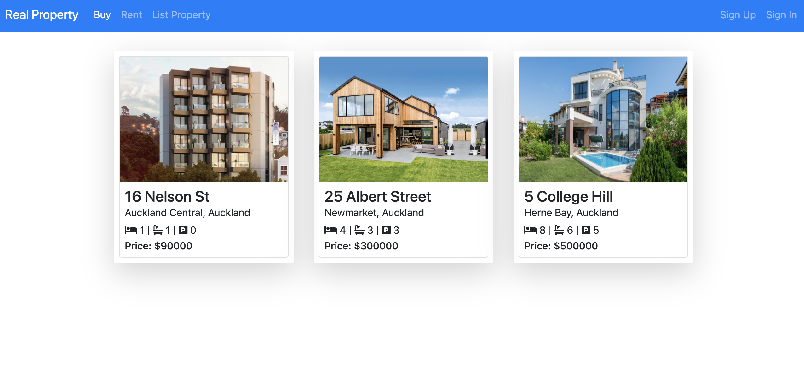
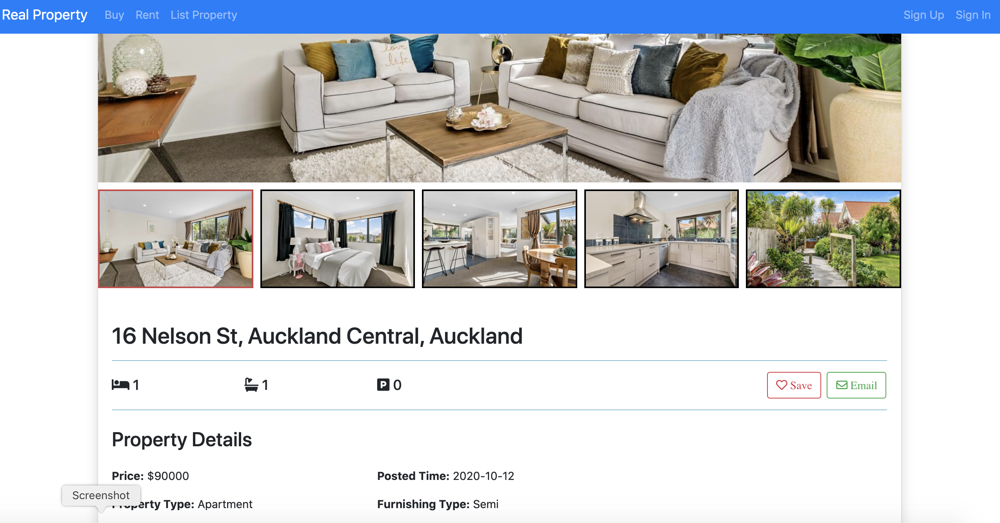
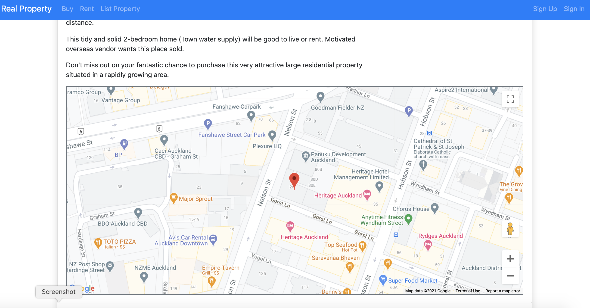

# Real Property App

This project is a real estate application that integrates renting, buying and listing properties, it supports auto completion of the address and the location display on the map. Angular framework, Typescript and Bootstrap are used in the front end, and the back end is implemented using .NET Core.

Demo URL: https://property-angular-app.netlify.app

## What is it built on

The backend is built using .Net core 5, SQL Server and Entity framework.
The frontend is built on Typescript, Angular 11, axios and Bootstrap.

## How do you run or recode it locally

### Backend

Since the back end is developed on .Net core, it is recommended to use Visual Studio on Windows environment, which is more friendly for .Net applications. You can also to run it using VS code, then you need to run the following command in the 'backend' directory :

```
dotnet run
```

### Frontend

In the 'frontend' directory, you also need to run:

```
npm install
ng serve
```

Afrer that, open a new browser to run

<http://localhost:4200/>

When complete, the app will look similar to that shown in the following screenshots:






